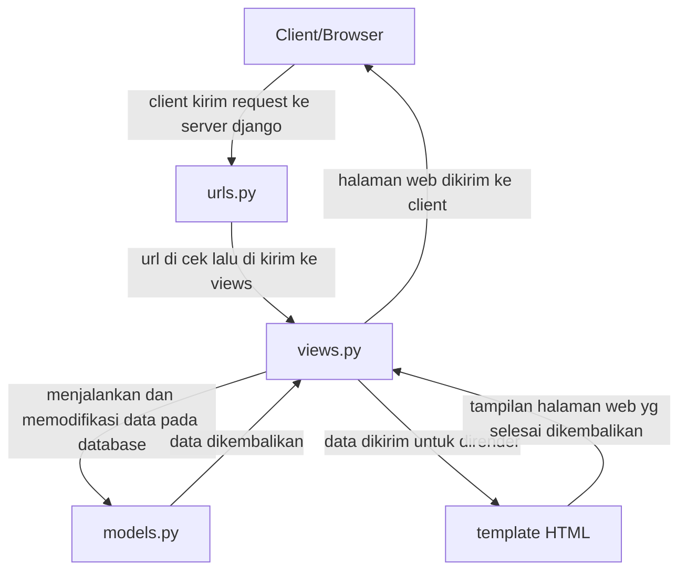

# Mena Shop

Repository untuk tugas indvidu PBP

Link Website:https://dzaky-ahmad-menashop.pbp.cs.ui.ac.id/

---
# Tugas 2

## Cara Saya Mengimplementasikan
1. **Inisiasi Proyek Django**
    - Membuat virtual enviroment dan mengaktifkannya - `python -m venv env` `env\Scripts\activate`
    - Membuat requirement.txt dan menginstal dependencies - `pip install -r requirements.txt`
    - Membuat proyeknya - django-admin startproject tugas_individu .

2. **Konfigurasi Environment Variables dan Proyek**
    - Membuat dan mengkonfigurasi `.env` dan `.env.prod`

3. **Menjalankan Server pada Django**
    - Jalankan migrasi database - `python manage.py migrate`
    - Jalankan server django - `python manage.py runserver`

4. **Membuat Aplikasi main**
    - Menambahkan ``main`` dalam variable `INSTALLED_APPS` pada `settings.py`

5. **Mengimplementasi model dan template**
    - Membuat direktori `templates` pada `main` dan membuat `main.html` serta mendesignnya
    - Membuat file `models.py` pada `main` dan menambahkan atribut-atributnya
    - Menambahkan fungsi `show_main` dalam `views.py`

6. **Routing**
    - Membuat `urls.py` dalam `main`
    - Menambahkan `path('', include('main.urls'))` pada `urls.py` pada `tugas_individu`

7. **Mendeploy**
    - Membuat repository pada GitHub
    - Mendeploy pada PWS

## Bagan Django

## Peran Settings.py
settings.py berfungsi untuk berbagai macam hal seperti:
- konfigurasi database
- mendaftarkan INSTALLED_APPS
- memilih middleware
- memilih konfigurasi keamanan

## Cara Kerja Migrasi Database
1. Membuat `models.py`
2. Jalankan `python manage.py makemigrations`
3. Jalankan `python manage.py migrate`

## Kenapa Django untuk Pemula?
Terdapat banyak fitur django yang tersedia, memudahkan pemula untuk belajar dengan cepat. Selain itu dokumentasi django bersifat rapih dan komprehensif sehingga mudah dilihat dan berguna untuk pengguna. Selain itu penggunaan MVT juga memudahkan pemula untuk belajar.

## Feedback Asdos Tutorial 1
Asdos sudah cukup membantu dalam tutorial sehingga jelas tentang hal yang harus dikerjakan.

---
# Tugas 3

## Mengapa Data Delivery?
Data delivery sangat diperlukan supaya data dari server dapat dikirim ke client dalam format yang konsisten. Tanpa data delivery, aplikasi hanya terbatas menampilkan HTML statis yang tidak interaktif.

## XML atau JSON
Saya lebih suka JSON dibandingkan XML karena JSON memiliki struktur sederhana dan mudah diproses dengan bahasa pemograman seperti Python. Walaupun itu XML lebih cocok untuk dokumen kompleks karena mendukung skema dan lebih deskriptif

Alasan JSON lebih populer:
- Sintaks mudah dipahami
- Didukung oleh kebanyakan bahasa modern yang populer
- Waktu proses cepat

## Apa Itu Fungsi `is_valid()` pada Form Django?
Method ini digunakan oleh Django untuk menvalidasi data yang dikirim lewat form, apakah sesuai aturan field atau tidak. Hal ini memastikan supaya tidak terjadi kesalahan input, sebagai contoh: memasukan huruf seperti "abcd" saat form meminta interger

## Mengapa Kita Butuh csrf_token?
`csrf_token` berfungsi untuk mencegah serangan Cross-Site Request Forgery (CSRF). Jika tidak ada token ini, penyerang bisa membuat form palsu di luar aplikasi kita yang mengeksekusi aksi berbahaya

## Cara Saya Mengimplementasikan
1. **Implementasi `base.html`**
    - Membuat folder baru bernama `templates` dan membuat file baru bernama `base.html`
    - Menambahkan `BASE_DIR / 'templates'` di dalam `DIRS` pada `TEMPLATES` di `settings.py`

2. **Membuat Form Input Data**
    - Membuat file baru pada `main` dengan nama `forms.py`
    - Isi dengan fields yang dibutuhkan untuk menambahkan produk

3. **Membuat Halaman Form untuk Menambahkan Produk**
    - Membuat fungsi baru bernama `create_product` pada `views.py`
    - Membuat file baru bernama `create_product.html` pada `main/templates`

4. **Membuat Halaman Detail Produk**
    - Membuat fungsi baru bernama `show_product` pada `views.py`
    - Membuat file baru bernama `show_product.html` pada `main/templates`

5. **Memodifikasi Halaman Main**
    - Menambahkan tombol untuk menambahkan produk
    - Membuat body untuk list produk yang dijual, jika tidak ada tunjukkan "Belum ada barang yang dijual"

6. **Menambahkan Fungsi untuk XML dan JSON**
    - Menambahkan fungsi `show_xml` dan `show_xml_by_id` pada `views.py`
    - Menambahkan fungsi `show_json` dan `show_json_by_id` pada `views.py`
    - Menambahkan path untuk fungsi-fungsi tersebut pada `urls.py`

## Feedback Asdos Tutorial 2
Asdos sangat membantu dengan masalah-masalah yang terjadi ketika kita mengerjakan tutorial.