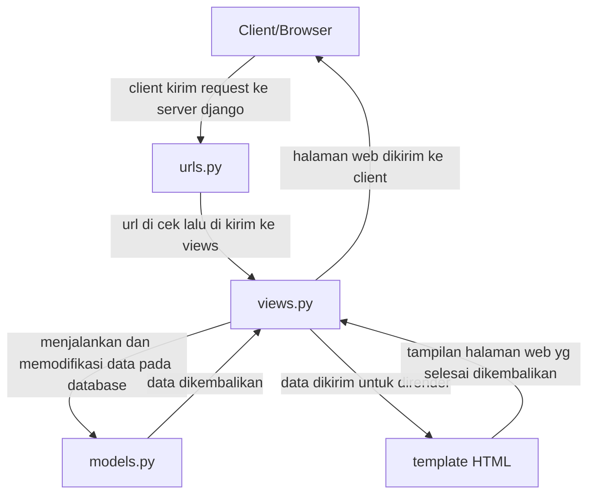

# Mena Shop

Repository untuk tugas indvidu PBP

Link Website:https://dzaky-ahmad-menashop.pbp.cs.ui.ac.id/


---
# Tugas 2

## Cara Saya Mengimplementasikan
1. **Inisiasi Proyek Django**
    - Membuat virtual enviroment dan mengaktifkannya - `python -m venv env` `env\Scripts\activate`
    - Membuat requirement.txt dan menginstal dependencies - `pip install -r requirements.txt`
    - Membuat proyeknya - django-admin startproject tugas_individu .

2. **Konfigurasi Environment Variables dan Proyek**
    - Membuat dan mengkonfigurasi `.env` dan `.env.prod`

3. **Menjalankan Server pada Django**
    - Jalankan migrasi database - `python manage.py migrate`
    - Jalankan server django - `python manage.py runserver`

4. **Membuat Aplikasi main**
    - Menambahkan ``main`` dalam variable `INSTALLED_APPS` pada `settings.py`

5. **Mengimplementasi model dan template**
    - Membuat direktori `templates` pada `main` dan membuat `main.html` serta mendesignnya
    - Membuat file `models.py` pada `main` dan menambahkan atribut-atributnya
    - Menambahkan fungsi `show_main` dalam `views.py`

6. **Routing**
    - Membuat `urls.py` dalam `main`
    - Menambahkan `path('', include('main.urls'))` pada `urls.py` pada `tugas_individu`

7. **Mendeploy**
    - Membuat repository pada GitHub
    - Mendeploy pada PWS

## Bagan Django


## Peran Settings.py
settings.py berfungsi untuk berbagai macam hal seperti:
- konfigurasi database
- mendaftarkan INSTALLED_APPS
- memilih middleware
- memilih konfigurasi keamanan

## Cara Kerja Migrasi Database
1. Membuat `models.py`
2. Jalankan `python manage.py makemigrations`
3. Jalankan `python manage.py migrate`

## Kenapa Django untuk Pemula?
Terdapat banyak fitur django yang tersedia, memudahkan pemula untuk belajar dengan cepat. Selain itu dokumentasi django bersifat rapih dan komprehensif sehingga mudah dilihat dan berguna untuk pengguna. Selain itu penggunaan MVT juga memudahkan pemula untuk belajar.

## Feedback Asdos Tutorial 1
Asdos sudah cukup membantu dalam tutorial sehingga jelas tentang hal yang harus dikerjakan.


---
# Tugas 3

## Mengapa Data Delivery?
Data delivery sangat diperlukan supaya data dari server dapat dikirim ke client dalam format yang konsisten. Tanpa data delivery, aplikasi hanya terbatas menampilkan HTML statis yang tidak interaktif.

## XML atau JSON
Saya lebih suka JSON dibandingkan XML karena JSON memiliki struktur sederhana dan mudah diproses dengan bahasa pemograman seperti Python. Walaupun itu XML lebih cocok untuk dokumen kompleks karena mendukung skema dan lebih deskriptif

Alasan JSON lebih populer:
- Sintaks mudah dipahami
- Didukung oleh kebanyakan bahasa modern yang populer
- Waktu proses cepat

## Apa Itu Fungsi `is_valid()` pada Form Django?
Method ini digunakan oleh Django untuk menvalidasi data yang dikirim lewat form, apakah sesuai aturan field atau tidak. Hal ini memastikan supaya tidak terjadi kesalahan input, sebagai contoh: memasukan huruf seperti "abcd" saat form meminta interger

## Mengapa Kita Butuh csrf_token?
`csrf_token` berfungsi untuk mencegah serangan Cross-Site Request Forgery (CSRF). Jika tidak ada token ini, penyerang bisa membuat form palsu di luar aplikasi kita yang mengeksekusi aksi berbahaya

## Cara Saya Mengimplementasikan
1. **Implementasi `base.html`**
    - Membuat folder baru bernama `templates` dan membuat file baru bernama `base.html`
    - Menambahkan `BASE_DIR / 'templates'` di dalam `DIRS` pada `TEMPLATES` di `settings.py`

2. **Membuat Form Input Data**
    - Membuat file baru pada `main` dengan nama `forms.py`
    - Isi dengan fields yang dibutuhkan untuk menambahkan produk

3. **Membuat Halaman Form untuk Menambahkan Produk**
    - Membuat fungsi baru bernama `create_product` pada `views.py`
    - Membuat file baru bernama `create_product.html` pada `main/templates`

4. **Membuat Halaman Detail Produk**
    - Membuat fungsi baru bernama `show_product` pada `views.py`
    - Membuat file baru bernama `show_product.html` pada `main/templates`

5. **Memodifikasi Halaman Main**
    - Menambahkan tombol untuk menambahkan produk
    - Membuat body untuk list produk yang dijual, jika tidak ada tunjukkan "Belum ada barang yang dijual"

6. **Menambahkan Fungsi untuk XML dan JSON**
    - Menambahkan fungsi `show_xml` dan `show_xml_by_id` pada `views.py`
    - Menambahkan fungsi `show_json` dan `show_json_by_id` pada `views.py`
    - Menambahkan path untuk fungsi-fungsi tersebut pada `urls.py`

## Screenshot Postman
- show_xml
  
- show_xml_by_id
  
- show_json
  
- show_json_by_id
  

## Feedback Asdos Tutorial 2
Asdos sangat membantu dengan masalah-masalah yang terjadi ketika kita mengerjakan tutorial.


---
# Tugas 4

## Apa itu Django AuthenticationForm?
`AuthenticationForm` adalah form bawaan Django yang digunakan untuk login user.

Kelebihan:
- Terintegrasi dengan sistem autentifikasi Django
- Otomatis validasi username dan password
- Mudah dipakai

Kelemahan:
- Terbatas sehingga perlu kustomisasi jika ingin login dengan multi-field
- Tampilan sederhana, sehingga perlu template override

## Perbedaan autentikasi dan otorisasi, bagaiamana Django mengimplementasikan kedua konsep tersebut
- Autentikasi = proses memastikan identitas user (siapa yang login).
- Otorisasi = proses memastikan user punya hak untuk melakukan aksi tertentu.

Implementasi di Django
- Autentikasi bisa dilakukan melewati fungsi `authenticate()` dan `login()`
- Otorisasi bisa dilakukan melewati `@login_required` atau `@permission_required`

## Kelebihan dan kekurangan session dan cookies 
- **Session**
  - Aman karena data disimpan di server
  - Penyimpanan data lebih besar
  - Tetapi membebani server jika banyak user

- **Cookies**
  - Ringan dan tidak membebani server
  - Disimpan di browser client
  - Rentan terhadap manipulasi oleh pengguna jika tidak dienkripsi

## Apakah penggunaan cookies aman secara default
Secara default penggunaan cookies tidak aman, banyak risiko seperti **Cookie Theft** dan **Session Hijacking** yang bisa terjadi. Untuk itu ada beberapa cara menangani hal tersebut, seperti:
- `HttpOnly=True` supaya cookie tidak bisa diakses JS.
- `SESSION_COOKIE_SECURE=True` supaya cookie dikirim via HTTPS.
- `CSRF token` untuk semua POST form.
- Session rotation setelah login.

## Cara Implementasi
1. **Membuat Fungsi dan Form Registrasi**
   - Menambahkan fungsi `register` pada `views.py`
   - Membuat file `register.html` pada `main/templates`
   - Menambahkan url pada `urls.py`

2. **Implementasi fungsi login dan logout**
   - Menambahkan fungsi `login_user` dan `logout_user` pada `views.py`
   - Memodifikasi fungsi `show_main` pada `views.py`
   - Membuat file `login.html` pada `main/templates`
   - Menambahkan url pada `urls.py`
   - Menambahkan tombol `logout` dan tulisan last login pada `main.html`

3. **Merestriksi Akses Halaman Main dan Show Product**
   - Menambahkan `@login_required(login_url='/login')` di atas fungsi `show_main` dan `show_product` pada `views.py`

4. **Menghubungkan Model Product dengan User**
   - Menambahkan potongan kode pada `models.py`
   - Memodifikasai function `create_product` dan `show_main` pada `views.py`
   - Menambahkan tombol My dan All pada `main.html`
   - Menambahkan seller pada `show_product.html`


---
# Tugas 5

## Urutan Prioritas Pengambilan CSS Selector
1. `!important`: Aturan CSS dengan `!important` memiliki prioritas tertinggi dan akan menimpa semua aturan lainnya untuk properti tertentu pada elemen tersebut.
2. **Sebaris (Inline Styles)**: Diterapkan langsung pada elemen HTML menggunakan atribut `style`.
3. **ID Selector**: Memiliki prioritas lebih tinggi daripada kelas, pseudo-kelas, dan atribut.
4. **Kelas, Pseudo-kelas, dan Atribut**: Selector jenis ini memiliki prioritas yang sama, seperti `.class`, `:hover`, dan `[type="text"]`.
5. **Element/Tag Selector**: Selector paling dasar yang menargetkan jenis elemen HTML tertentu, seperti `div` atau `p`

## Kenapa Website Responsive Penting
Mengapa website responsisve penting:
- Pengguna dapat akses website pada device berbeda
- User experience lebih nyaman
- SEO friendly (Google memprioritaskan web yang mobile-friendly)

Contoh aplikasi yang menerapkannya:
- Wikipedia
- Twitter (X)
- Tokopedia
## Perbedaan Antara Margin, Border, dan Padding
- Margin = ruang luar antar elemen.
- Border = garis tepi elemen.
- Padding = ruang dalam antara konten dengan border.

```css
.example {
  margin: 10px;              /* ruang antar elemen */
  border: 1px solid black;   /* garis tepi */
  padding: 5px;             /* ruang antara konten dan border */
}
```

## Konsep Flex Box dan Grid Layout
- **Flexbox**
  - Layout fokus ke satu dimensi
  - Contoh: navbar, daftar produk
- **Grid Layout**
  - Layout fokus ke dua dimensi
  - Contoh: konten utama, footer

## Cara Implementasi
1. **Menambahkan Fitur Edit Product**
   - Menambahkan fungsi `edit_product` pada `views.py`
   - Membuat file `edit_product.html` pada `main/templates`
   - Menambahkan url pada `urls.py`
   - Menambahkan tombol Edit pada `main.html`

2. **Menambahkan Fitur Delete Product**
   - Menambahkan fungsi `delete_product` pada `views.py`
   - Menambahkan url pada `urls.py`
   - Menambahkan tombol Delete pada `main.html`
     
3. **Menambahkan Navigation Bar**
   - Membuat file `navbar.html` pada `templates`
   - Menambahkan `` pada `main.html`

4. **KOnfigurasi Static**
   - Memodifikasi `settings.py`

5. **Mendesign dengan Tailwind**
   - Menambahkan Tailwind ke aplikasi pada `base.html`
   - Membuat folder abru bernama `static` dan folder baru di dalamnya bernama `css`, membuat file baru bernama `global.css`
   - Menghubungkan `global.css` dan Tailwind di `base.html`
   - Styling setiap file pada `main/templates` serta `navbar.html`


---
# Tugas 6

## Perbedaan Synchronous Request dan Asynchronous Request
- **Synchronous:**
  - Browser menunggu server setelah request dikirim. Hal ini membuat halaman tidak bisa diakses untuk sementara
- **Asynchronous:**
  - Browser mengirim request ke server di background, sehingga tidak perlu memblokir akses ke halaman

## Bagaimana AJAX Bekerja di Django 
1. User melakukan request
2. JavaScript mengirim request ke URL Django
3. Django memproses data lalu mengirim kembali hasilnya
4. JavaScript menerima hasil lalu men-update tampilan dengan DOM

## Keuntungan Menggunakan AJAX Dibandingkan Render Biasa di Django
- Lebih cepat dikarenakan tidak perlu reload halaman tiap request
- Lebih interaktif
- Bisa menggunakan fitur real-time (live-chat, dll.)

## Cara Memastikan Keamanan Saat Menggunakan AJAX untuk Login dan Register
- Gunakan **CSRF Token** pada setiap request
- Gunakan **HTTPS** supaya data login di-enskripsi
- Batasi **response** data agar tidak tersebar informasi sensitif
- Validasi input di **server-side**

## Bagaimana AJAX Mempengaruhi Pengalaman Pengguna
- User merasa web lebih responsif
- Tampilan lebih interaktif
- Interaksi seamless
- Bisa memberikan feedback instant
