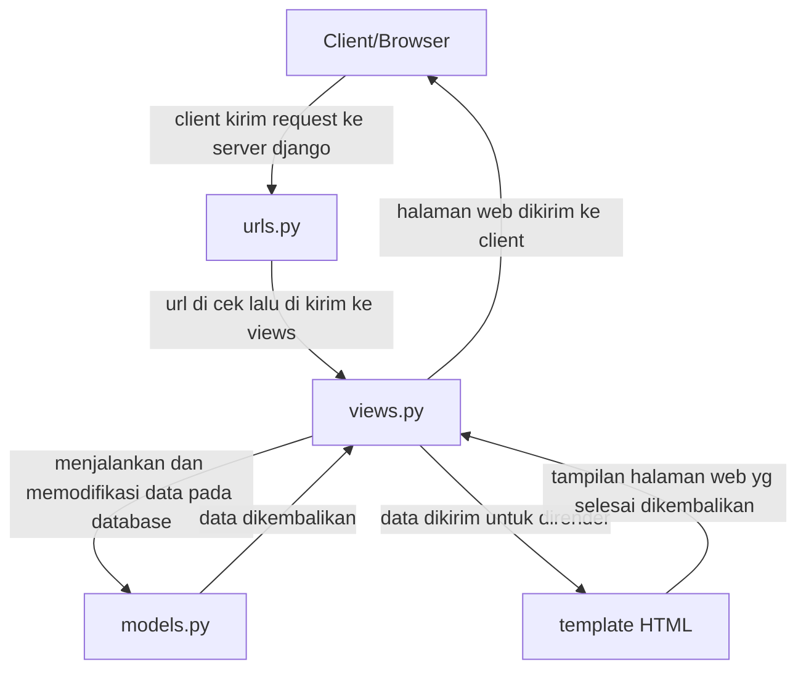

# Mena Shop

Repository untuk tugas indvidu PBP

Link Website:https://dzaky-ahmad-menashop.pbp.cs.ui.ac.id/

## Cara Saya Mengimplementasikan
1. **Inisiasi Proyek Django**
    - Membuat virtual enviroment dan mengaktifkannya - 'python -m venv env' 'env\Scripts\activate'
    - Membuat requirement.txt dan menginstal dependencies - 'pip install -r requirements.txt'
    - Membuat proyeknya - django-admin startproject tugas_individu .

2. **Konfigurasi Environment Variables dan Proyek**
    - Membuat dan mengkonfigurasi '.env' dan '.env.prod'

3. **Menjalankan Server pada Django**
    - Jalankan migrasi database - 'python manage.py migrate'
    - Jalankan server django - 'python manage.py runserver'

4. **Membuat Aplikasi main**
    - Menambahkan ''main'' dalam variable 'INSTALLED_APPS' pada 'settings.py'

5. **Mengimplementasi model dan template**
    - Membuat direktori 'templates' pada 'main' dan membuat 'main.html' serta mendesignnya
    - Membuat file 'models.py' pada 'main' dan menambahkan atribut-atributnya
    - Menambahkan fungsi 'show_main' dalam 'views.py'

6. **Routing**
    - Membuat 'urls.py' dalam 'main'
    - Menambahkan 'path('', include('main.urls'))' pada 'urls.py' pada 'tugas_individu'

7. **Mendeploy**
    - Membuat repository pada GitHub
    - Mendeploy pada PWS

## Bagan Django

## Peran Settings.py
settings.py berfungsi untuk berbagai macam hal seperti:
- konfigurasi database
- mendaftarkan INSTALLED_APPS
- memilih middleware
- memilih konfigurasi keamanan

## Cara Kerja Migrasi Database
1. Membuat 'models.py'
2. Jalankan 'python manage.py makemigrations'
3. Jalankan 'python manage.py migrate'

## Kenapa Django untuk Pemula?
Terdapat banyak fitur django yang tersedia, memudahkan pemula untuk belajar dengan cepat. Selain itu dokumentasi django bersifat rapih dan komprehensif sehingga mudah dilihat dan berguna untuk pengguna. Selain itu penggunaan MVT juga memudahkan pemula untuk belajar.

## Feedback Asdos
Asdos sudah cukup membantu dalam tutorial sehingga jelas tentang hal yang harus dikerjakan.